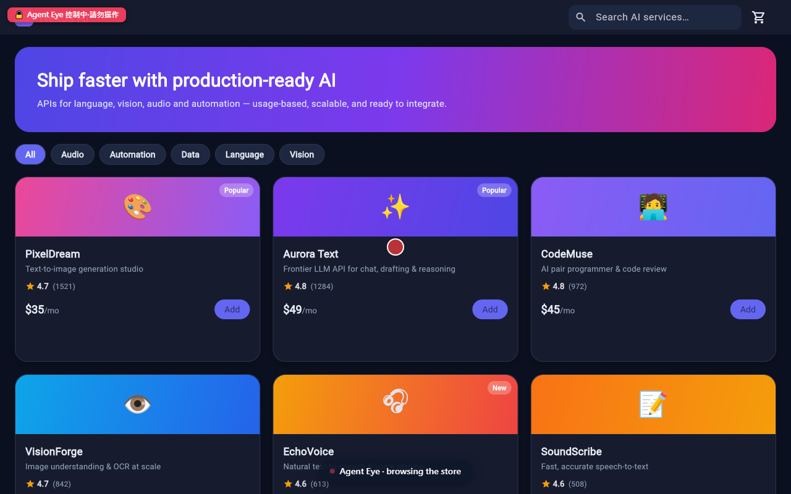
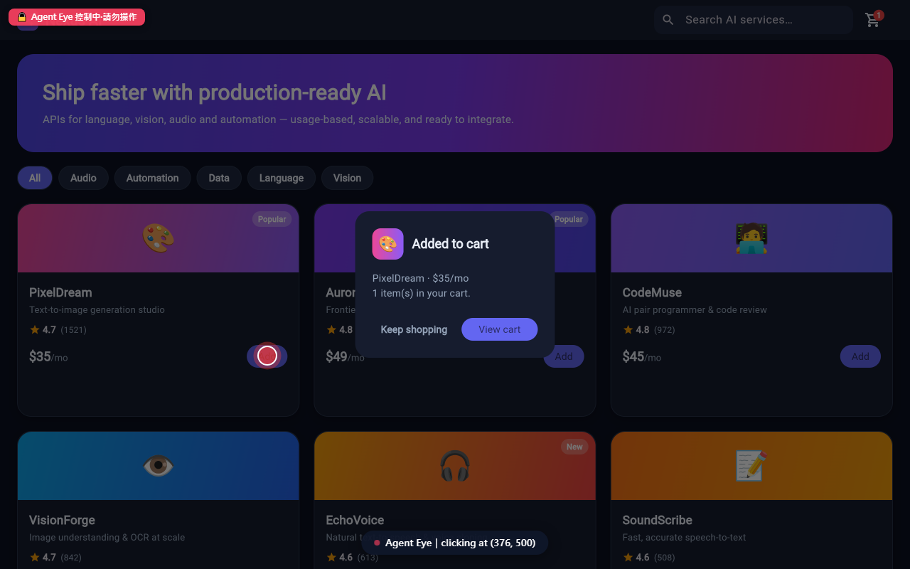
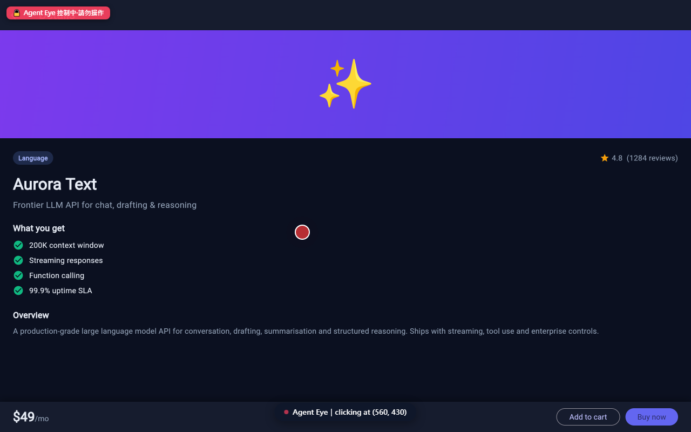
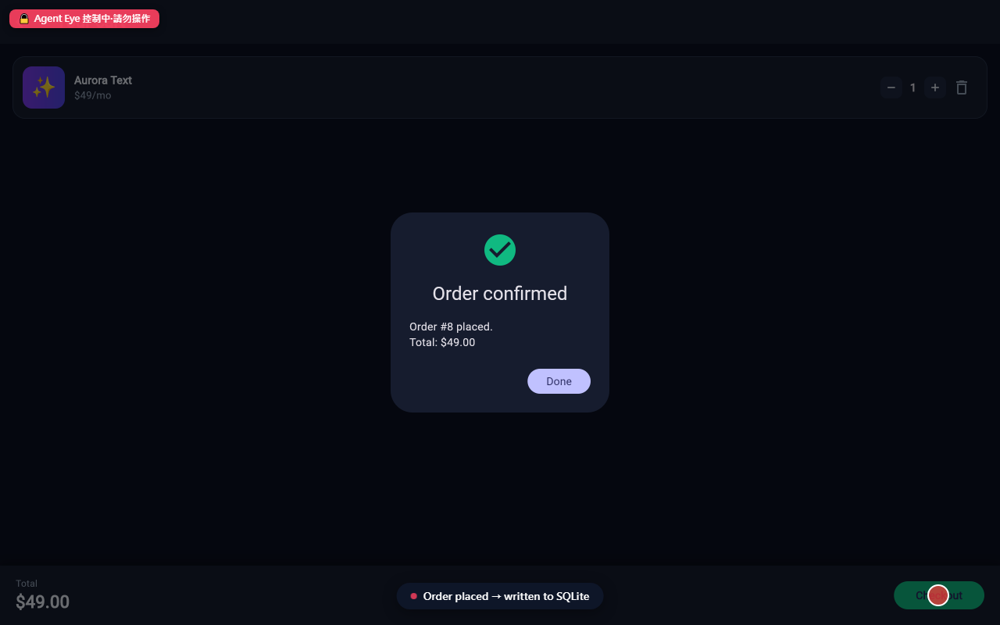
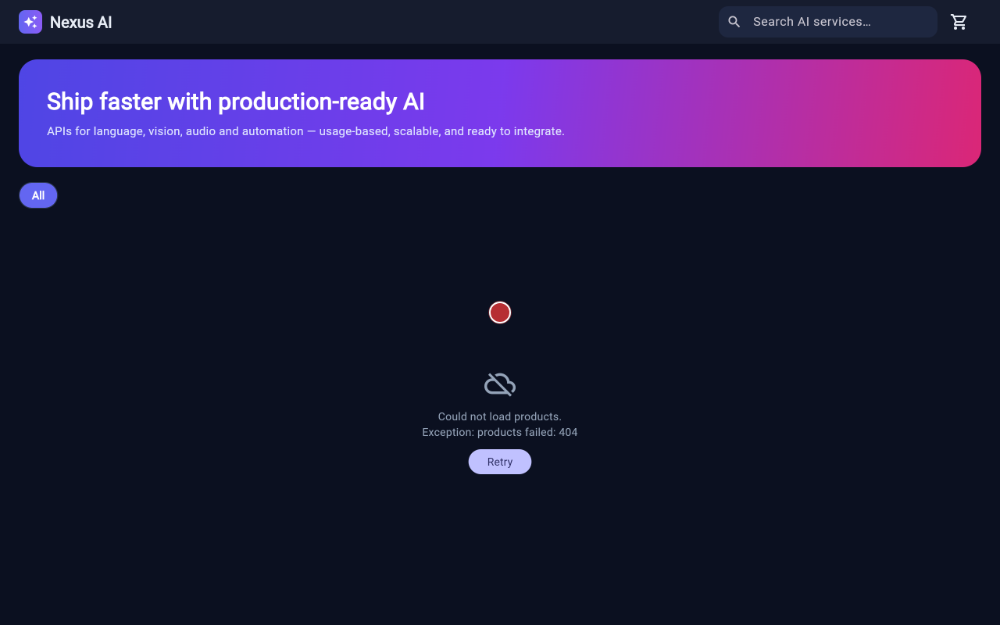
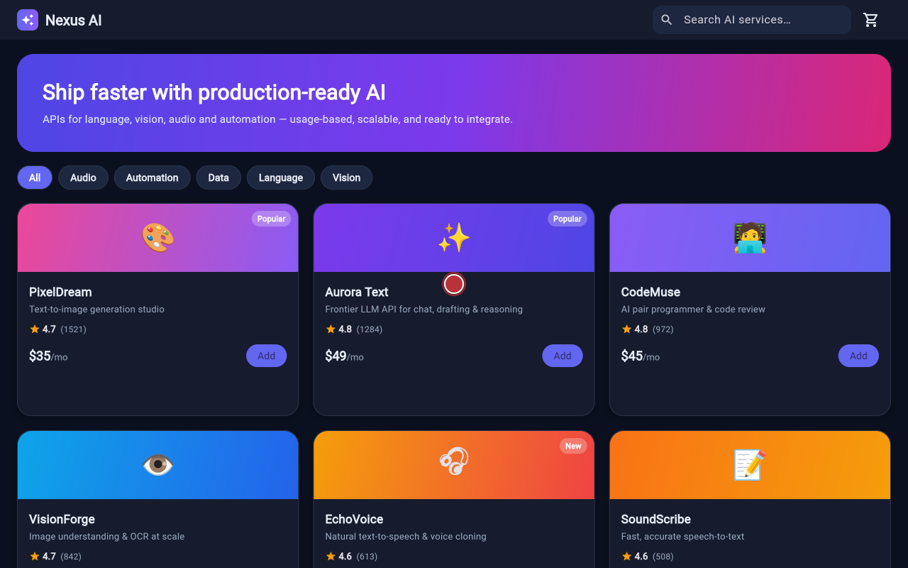

# Agent Eye

Give AI coding agents **eyes and hands in the browser** — so they can start your
dev servers, drive a visible browser, read console/network/DOM, and debug your
frontend the way you would, while you watch.

Agent Eye is an **MCP server** (the capability) wrapped in a **VS Code extension**
(the convenience + a live activity view). Because the capability is exposed over
the [Model Context Protocol](https://modelcontextprotocol.io), it works with
Claude Code, Cursor, GitHub Copilot agent mode, and any MCP-aware agent — not
just one.

> Status: v0.1 (MVP). The full autonomous loop
> (start dev server → open browser → snapshot → interact → read console → find bug)
> is implemented and verified end-to-end.

## Demo

The agent drives a **real, visible browser** while you watch. A pulsing red dot
is the agent's cursor; the 🔒 badge (top-left) shows your keyboard/mouse are
locked out while it works; a status banner (bottom) narrates each step. Below: a
full-stack demo app (Flutter web + Python/FastAPI + SQLite) driven entirely by
Agent Eye — browse → add to cart → open detail → check out (writing a real row to
SQLite).

| Browsing the store | Add-to-cart (agent clicked "Add") |
|---|---|
|  |  |

| Product detail (navigated) | Order confirmed → written to SQLite |
|---|---|
|  |  |

**Catching a real bug** — the kind that compiles fine but breaks at runtime. A
wrong API endpoint (`/productz`) makes the page fail; Agent Eye pinpoints it from
the **network log** (`GET /api/productz → 404`), and after the one-line fix,
re-verifies on the real frontend (`GET /api/products → 200`, products render):

| Bug: products fail to load (404) | Fixed & re-verified on the real UI |
|---|---|
|  |  |

> Every screenshot is real output captured by Agent Eye's `browser_screenshot`
> and saved to the activity timeline. To run the demo yourself: build the repo,
> start the sample servers, then run `packages/mcp-server/live-demo.mjs`
> (or double-click **`DEMO.cmd`** on Windows).

---

## Why

Coding agents can write code but usually can't *verify* it in a real browser.
Agent Eye closes that loop, following the design in [`plan.v1.md`](plan.v1.md).
Its defining principle is **server-side permission enforcement**: every action an
agent takes is checked against a policy inside the tool implementation, never by
asking the agent to behave. A prompt-injected agent still cannot exceed what the
user authorized. See [Security model](#security-model).

## Architecture

```
VS Code Extension (packages/vscode-extension)      MCP Server (packages/mcp-server)
  · "Setup for Claude Code" → writes .mcp.json        · Playwright browser control (headed)
  · McpServerDefinitionProvider (Copilot, 0-config)   · Dev-server lifecycle management
  · Activity sidebar (screenshots / logs / steps)     · Permission policy engine (7.1)
                                                       · SSRF / command / redaction guards (7.2/7.6)
                                                       · Artifacts → .agent-artifacts/
        └────────── spawns (stdio) ──────────────────────────┘
```

The extension does **not** call the agent; the agent (Claude Code, etc.) spawns
the MCP server and calls its tools. The extension only makes setup one click and
shows you what's happening.

## Installation

### Prerequisites

| Requirement | Why |
|---|---|
| **Node.js ≥ 20** | Runs the MCP server (bundled inside the extension). Check with `node -v`. |
| **VS Code ≥ 1.104** | The extension host. |
| **An AI coding agent** | Claude Code, Cursor, or GitHub Copilot agent mode (any MCP-aware agent). |
| **A Chromium browser** | Installed on first run (see step 3), or reuse system Chrome/Edge. |

#### Install Node.js per OS

<details><summary><b>Windows</b></summary>

```powershell
winget install OpenJS.NodeJS.LTS      # or download from https://nodejs.org
node -v                               # expect v20+ 
```
Commands below work in **PowerShell** or **Git Bash**. Headed browser windows
appear on your desktop as normal.
</details>

<details><summary><b>macOS</b></summary>

```bash
brew install node                     # or download from https://nodejs.org
node -v                               # expect v20+
```
On first headed launch, macOS may ask for Screen Recording / Accessibility
permission for the terminal/VS Code — allow it so the browser window shows.
</details>

<details><summary><b>Linux</b></summary>

```bash
# Debian/Ubuntu (via nodesource) — or use nvm / your distro's package
curl -fsSL https://deb.nodesource.com/setup_20.x | sudo -E bash - && sudo apt-get install -y nodejs
node -v                               # expect v20+

# Playwright's Chromium needs a few system libs on a fresh box:
npx playwright install-deps chromium
```
A headed browser needs a display (X11/Wayland). On a headless server/CI, set
`AGENT_EYE_HEADLESS=1` (screenshots still work; there's just no on-screen window).
</details>

### Option A — install the packaged `.vsix` (recommended)

**Step 1 — build the `.vsix`** (from a clone of this repo):

```bash
git clone https://github.com/<you>/agent-eye.git
cd agent-eye
npm install            # installs workspace deps
npm run build          # builds the extension + bundles the MCP server
cd packages/vscode-extension
npx @vscode/vsce package --no-dependencies
# → produces agent-eye-0.1.0.vsix (~120 KB)
```

**Step 2 — install it into VS Code** (either way):

```bash
code --install-extension agent-eye-0.1.0.vsix
```

…or in VS Code: open the Command Palette (`Ctrl/Cmd+Shift+P`) → **“Extensions:
Install from VSIX…”** → pick `agent-eye-0.1.0.vsix`. Then reload VS Code.

**Step 3 — install the browser runtime (one time).** The `.vsix` bundles the MCP
server but *not* Playwright (it's large + has native binaries). On first
activation the extension pops a prompt — click **Install now** — or run **“Agent
Eye: Install Browser Runtime (Playwright)”** from the Command Palette. It installs
Playwright + Chromium into the extension's global storage; the server finds it via
`NODE_PATH`. (Prefer your existing browser? Set `agentEye.browserChannel` to
`chrome` or `msedge` and skip this.)

**Step 4 — that's it: your agents are wired up automatically.** On first run the
extension **auto-installs** the Agent Eye skill and registers the MCP server into
your agents' global config, so you never place a file by hand:

- **Claude Code** → skill to `~/.claude/skills/agent-eye/`, MCP server merged into
  `~/.claude.json` (backed up first, existing entries preserved).
- **Codex** → skill to `~/.codex/skills/agent-eye/` (if Codex is detected).
- **GitHub Copilot (VS Code)** → MCP server registered live via the editor's
  `McpServerDefinitionProvider` (no config file needed).

Disable this with the `agentEye.autoInstall` setting; re-run it anytime with
**“Agent Eye: Reinstall Agent Integrations”**.

### Option B — from source, per-project (no `.vsix`)

If you just want it in one project without installing the extension:

```bash
npm install && npm run build
npx playwright install chromium          # browser runtime
```

Then run **“Agent Eye: Setup for Claude Code”** from VS Code (writes a project
`.mcp.json` + installs the skill into `.claude/skills/`), **or** create
`.mcp.json` yourself:

```json
{
  "mcpServers": {
    "agent-eye": {
      "command": "node",
      "args": ["<abs-path>/packages/mcp-server/dist/index.js", "--workspace", "<abs-path-to-your-project>"],
      "env": { "AGENT_EYE_SHOW_CURSOR": "1" }
    }
  }
}
```

## Using it

Once installed, just ask your agent to do frontend work — the skill makes it use
the visible browser automatically:

> *“Start the dev server, open the app, click through the signup flow, and fix
> whatever's broken.”*

A browser window opens on your screen; a red cursor moves, clicks, and types while
a 🔒 badge shows your keyboard/mouse are locked out (the agent is driving). The
agent reads the console/network to find real bugs, fixes the code, reloads, and
re-verifies — then closes the window when done.

- **Claude Code / Cursor** — after Option A (or `Setup for Claude Code`), restart
  the agent / reload its MCP servers so the `agent-eye` tools appear.
- **VS Code Copilot agent mode** — nothing to configure; the tools are registered
  automatically.
- Open the **Agent Eye** sidebar (the eye icon) to watch screenshots, logs, and
  the action timeline live.

## Publishing to a Marketplace

Want to distribute Agent Eye so others install it with one click? See
**[PUBLISHING.md](PUBLISHING.md)** for the full step-by-step (VS Code Marketplace
via `vsce`, and Open VSX for Cursor/VSCodium via `ovsx`).

## Works with any frontend

Agent Eye is **framework-agnostic** — it is one universal tool, not a per-framework
template. It operates at two layers that don't care what framework you used:

- The **browser** (Playwright) sees the same DOM, screen, console, and network
  whether the page came from React, Vue, Svelte, Angular, SolidJS, plain
  HTML/CSS/JS, or Flutter web.
- **`start_dev_server`** runs *any* allowlisted command. The only per-framework
  difference is the dev command string — which is data, not code.

So you don't need a different setup per stack. Point the agent at your project and
tell it which command starts the dev server. Common ones (all allowlisted by
default):

| Stack | Typical dev command |
|---|---|
| React / Vite / Vue / Svelte | `npm run dev` · `pnpm dev` · `vite` |
| Next.js / Nuxt / Astro / Remix | `npm run dev` |
| Angular | `ng serve` |
| Plain HTML/CSS/JS | `python -m http.server 5500` · `npx serve` · `npx http-server` |
| **Flutter web** | `flutter run -d web-server --web-port 5500` |
| Django / Flask | `python manage.py runserver` · `flask run` |
| Rails / Jekyll / Hugo | `rails server` · `jekyll serve` · `hugo server` |

> **Flutter / canvas apps**: Flutter web renders to a canvas (CanvasKit), so the
> accessibility snapshot can be sparse. Agent Eye detects this and tells the agent
> to fall back to `browser_screenshot` (see the page) + coordinate clicks, while
> still using console/network logs — the debug loop still works, just vision-first
> instead of snapshot-first. Add any extra dev commands to `commandAllowlist` in
> `.agent-eye/policy.json`.

## Agent Skill: make every agent use it automatically

[`skills/agent-eye/SKILL.md`](skills/agent-eye/SKILL.md) is an Agent Skill that
makes AI agents treat browser verification as **mandatory for all frontend
work**: run the dev server, open the visible window, operate the real UI, read
console/network, fix, re-verify, and demo to the user. The VS Code command
**"Agent Eye: Setup for Claude Code"** installs it into the workspace's
`.claude/skills/agent-eye/` automatically (alongside `.mcp.json`); or copy it
there yourself (project) / to `~/.claude/skills/` (all projects).

## Tools

| Tool | Action category | Purpose |
|---|---|---|
| `browser_navigate(url)` | interact / highRisk | Open an http(s) URL (allowlisted hosts only). |
| `browser_snapshot()` | observe | Accessibility-tree snapshot with `[ref=eN]` handles — the agent's primary "eyes". |
| `browser_click(target)` | interact | Click by ref or Playwright selector. |
| `browser_click_at(x, y)` | interact | Click at viewport coordinates — for canvas UIs (Flutter web, WebGL, games) with no selectable DOM. |
| `browser_type(target, text, submit?)` | interact / sideEffect | Fill an input; `submit` presses Enter (side-effecting). |
| `browser_screenshot(fullPage?)` | observe | PNG saved to the timeline and returned. |
| `browser_get_console_logs(limit?)` | observe | Console messages + uncaught errors. |
| `browser_get_network_requests(limit?)` | observe | Requests with **sensitive headers redacted**. |
| `browser_show_status(message)` | interact | Live narration banner in the window so the watching user can follow the agent's work. |
| `browser_close()` | — | Close the window when done (also auto-closes after idle; server stays alive & relaunches lazily). |
| `browser_evaluate(expression)` | highRisk | Arbitrary JS — **disabled by default**. |
| `start_dev_server(id, command, args?, cwd?)` | execute / highRisk | Spawn an allowlisted command, cwd confined to the workspace. |
| `get_dev_server_logs(id, limit?)` | observe | stdout/stderr + status. |
| `stop_dev_server(id)` | execute | Terminate an owned process tree. |

## Security model

Enforced **inside the server**, so a manipulated agent can't get past it. Full
detail in [`plan.v1.md` §7](plan.v1.md).

- **Action categories × allow/ask/deny** (`.agent-eye/policy.json`). Defaults are
  tuned for testing a **local** frontend: observation, page interaction,
  side-effecting actions, and dev-server starts all `allow`; high-risk
  (`evaluate`, non-allowlisted commands/domains) `deny`. The hard guards below
  hold regardless, and you can tighten any category to `ask`/`deny` in
  `policy.json`. (`ask` uses MCP elicitation, which not all clients surface —
  hence the local-dev defaults lean on the hard guards rather than prompts.)
  A denied action returns a clear *policy boundary* error so the agent knows not
  to retry.
- **Navigation scope**: only http(s) to allowlisted hosts (localhost by default).
  `file://`/`chrome://`, cloud-metadata and link-local IPs are hard-blocked
  regardless of policy (SSRF defense).
- **Command scope**: argv-only spawn (no shell), shell metacharacters rejected,
  cwd confined to the workspace, executables allowlisted.
- **Dedicated browser profile** (`.agent-eye/browser-profile/`) — never your real
  one, so the agent never inherits your logins or saved passwords.
- **Input lock**: while the agent drives a headed window, your real mouse/keyboard
  are blocked (transparent overlay + key trap, with a 🔒 badge) so you can't
  collide with it; the agent lifts the lock only for its own dispatched action.
- **Prompt-injection framing**: all page-derived content is wrapped as untrusted
  data. The real guarantee is the policy, not the framing.
- **Secret hygiene**: `Authorization`/`Cookie`/token-like values redacted from
  network artifacts; `.agent-artifacts/` and `.agent-eye/` are gitignored.
- **Single-instance lock**: the first server owns the browser/dev servers per
  workspace; a second instance reports it cleanly instead of crashing.

### Configuration knobs

| Env var (server) | Setting (extension) | Effect |
|---|---|---|
| `AGENT_EYE_WORKSPACE` | — | Workspace root (defaults to cwd / `--workspace`). |
| `AGENT_EYE_BROWSER_CHANNEL` | `agentEye.browserChannel` | `chrome`/`msedge` to use an installed browser. |
| `AGENT_EYE_HEADLESS=1` | — | Run headless (CI / remote). Headed is the default. |
| `AGENT_EYE_SHOW_CURSOR` | `agentEye.showCursor` | Pulsing cursor overlay so you can watch where the agent points/clicks (Playwright doesn't move the real OS pointer). On by default. |
| `AGENT_EYE_SLOWMO` | `agentEye.slowMoMs` | Slow each action by N ms so you can follow along (e.g. 300–800). |
| `AGENT_EYE_INPUT_LOCK` | — | Lock the user's mouse/keyboard while the agent drives (default on when headed; `0` disables). |
| `AGENT_EYE_DEVICE_SCALE` | — | Render scale factor (default `2`) — keeps canvas UIs crisp on HiDPI displays. |
| `AGENT_EYE_IDLE_CLOSE_MS` | — | Auto-close the window after this many ms idle (default `180000`; `0` disables). |
| `AGENT_EYE_BROWSER_CHANNEL` | `agentEye.browserChannel` | (also above) `chrome`/`msedge` to reuse an installed browser. |
| `AGENT_EYE_LOG_LEVEL` | `agentEye.logLevel` | `debug`/`info`/`warn`/`error`. |
| — | `agentEye.autoInstall` | Auto-install the skill + MCP into agents' global config on first run (default on). |

## Troubleshooting

| Symptom | Fix |
|---|---|
| **Tools don't appear** in Claude Code | Restart Claude Code or reload its MCP servers so it re-reads `.mcp.json` / global config. |
| **"Playwright is not installed"** | Run **“Agent Eye: Install Browser Runtime”**, or `npx playwright install chromium` (Linux may also need `npx playwright install-deps chromium`). |
| **Browser opens but the page is blank** | For a compiled frontend, a stale service-worker/build cache can serve the old app — hard-reload / clear cache / do a clean rebuild. Flutter *debug* (`flutter run -d web-server`) can stall on a second browser; prefer `flutter build web --release` + a static server. |
| **UI looks blurry** on a HiDPI/scaled display | It renders at 2x by default; adjust with `AGENT_EYE_DEVICE_SCALE`. |
| **"Another Agent Eye instance owns the browser"** | Another session (per workspace) holds it — close that session/MCP client, then retry. |
| **A dev-server start is refused by policy** | The category is set to `deny` in `.agent-eye/policy.json`, or the command isn't allowlisted — add it to `commandAllowlist`. |
| **No visible window when *you* run a demo from a script** | The window appears in whatever OS session launched the server. Your agent spawns it in your session (so it shows); a background/sandboxed shell may render off-screen. On Windows, launch the demo from a normal terminal (see `DEMO.cmd`). |
| **The window lingers after a task** | It auto-closes after `AGENT_EYE_IDLE_CLOSE_MS` (default 3 min); the agent can also call `browser_close`. |

## Development

```bash
npm run build       # build both packages
npm run typecheck   # type-check both packages
```

Layout:

- `packages/mcp-server` — the MCP server (TypeScript, ESM). Entry: `dist/index.js`.
- `packages/vscode-extension` — the VS Code extension (bundled with esbuild).

## License

MIT
